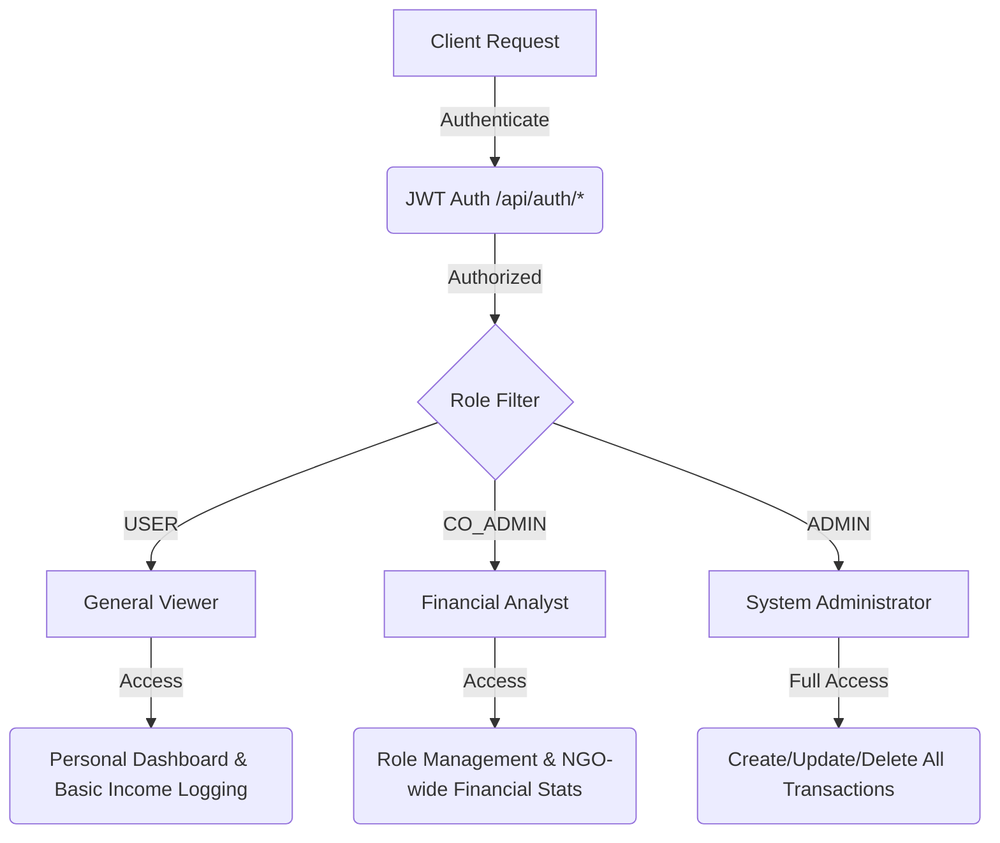
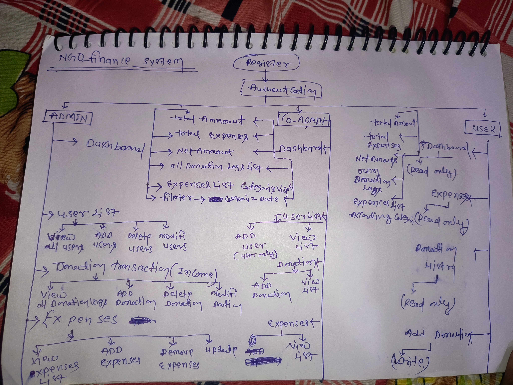

# NGO Finance Management System - Backend

**Comprehensive Financial Orchestration & Access Control Logic**

---


## 📖 Project Overview

The **NGO Finance Management System** is a robust, enterprise-grade RESTful API backend designed to manage complex financial transactions with high precision and security. Built using the **Spring Boot 3.x ecosystem**, the architecture implements a strict layered design (Controller-Service-Repository) to ensure maximum scalability, maintainability, and security.

The platform utilizes stateless JWT-based authentication to manage access controls natively. At its core, the application executes vital transactional operations via Spring Data JPA ORM mappings, reliably persisting discrete financial models (Incomes and Expenses).

---

## 🛠️ Technical Stack

| Category | Technology |
| :--- | :--- |
| **Language** | Java 17 |
| **Framework** | Spring Boot 3.2.4 |
| **Security** | Spring Security 6.x & Stateless JWT (JJWT) |
| **Data Persistence** | Spring Data JPA (Hibernate) |
| **Database** | H2 In-Memory Database (Zero-Config Development) |
| **Build System** | Maven |
| **Boilerplate** | Project Lombok (Annotation Processing) |
| **Validation** | Jakarta Bean Validation (Hibernate Validator) |
| **Monitoring** | Spring Boot DevTools (Live Reload) |

---

## ✅ Core Technical Features

* **Stateless Role-Based Authentication:** Implements `OncePerRequestFilter` chains via Spring Security. It parses and cryptographically validates JSON Web Tokens (JWT) upstream, leveraging extracted token claims to populate the global `SecurityContextHolder`.
* **Robust Financial ORM Modeling:** Tracks relational models for `Donation` (Income) and `Expense` via JPA Entities. Both classes invoke global audit lifecycle mechanisms (server-side metadata logging).
* **Real-time API Aggregation:** The `/api/dashboard` route interceptor executes advanced functional Java Streams to aggregate Net Revenue and Total Operations directly in memory.
* **Resilient Data Integrity:** Leverages Jakarta Bean Validation API. Custom REST interfaces trigger `@Valid` evaluations, with global error handling via `@RestControllerAdvice`.
* **Elevated Administration Pipelines:** Leverages Spring `Pagewrapper` structures for efficient handling of massive persistent datasets.

---

## 🔀 System Workflow (Role-Based)

The application logically segregates system access based on the Role embedded within your authenticated JWT:



### 🎨 Conceptual Design (Original Paper Sketch)

The core logic and system flow were originally conceptualized on paper to ensure structured transaction processing:



---

## 📋 Comprehensive API Route Directory

| Category | Method | Endpoint | Description | Access |
| :--- | :--- | :--- | :--- | :--- |
| **Auth** | `POST` | `/api/auth/register` | User Onboarding | Public |
| **Auth** | `POST` | `/api/auth/authenticate` | Token Generation (Login) | Public |
| **Stats** | `GET` | `/api/dashboard` | Real-time Finance Analytics | Auth Req |
| **Income** | `POST` | `/api/transactions/donations` | Log Financial Influx | USER/ADMIN |
| **Expense** | `POST` | `/api/transactions/expenses` | Log Project Expenses | ADMIN |
| **Delete** | `DELETE` | `/api/transactions/donations/{id}` | Purge Income Record | ADMIN |
| **Delete** | `DELETE` | `/api/transactions/expenses/{id}` | Purge Expense Record | ADMIN |
| **Admin** | `GET` | `/api/admin/donors` | Paginated Donor Insights | CO_ADMIN/ADMIN |
| **Admin** | `GET` | `/api/admin/donations` | List All Logged Donations | CO_ADMIN/ADMIN |
| **Admin** | `GET` | `/api/admin/expenses` | List All NGO Expenses | CO_ADMIN/ADMIN |

---

## 📡 Required Testing Scenarios (Postman JSON)

### 1. Register a Core User
**POST** `/api/auth/register`
```json
{
    "fullName": "Ashish Kumar Rathour",
    "phone": "9876543210",
    "email": "ashish.rathour@finance.com",
    "password": "SecurePassword123"
}
```

### 2. Procure Access Token (Login)
**POST** `/api/auth/authenticate`
```json
{
    "email": "ashish.rathour@finance.com",
    "password": "SecurePassword123"
}
```

### 3. Log a Donation Record
**POST** `/api/transactions/donations` *(Requires Auth Token)*
```json
{
    "amount": 255000.00,
    "offlineDonorName": "Rural Development Fund - Tech Corp Pvt Ltd",
    "targetUserId": null
}
```

### 4. Log an Expense Record
**POST** `/api/transactions/expenses` *(Requires Auth Token)*
```json
{
    "category": "Medical & Community Health",
    "amount": 42000.50,
    "description": "Procured medical supplies and logistics for the upcoming health camp. Authorized by Ashish Rathour."
}
```

---

## 🔑 Default Credentials (Seed Data)

The following accounts are automatically created on startup via `DataInitializer.java`.

| Role | Email (ID) | Default Password |
| :--- | :--- | :--- |
| **Super Admin** | `admin@ngo.in` | `Admin@NGO#2026` |

> [!TIP]
> You can override the Super Admin password by setting the `ADMIN_PASSWORD` environment variable before running the app.

---

## 📖 Live API Documentation (Swagger)

You can interact with the API directly through the built-in Swagger UI. This provides a live testing environment for all endpoints.

- **Swagger UI URL:** `http://localhost:8080/swagger-ui/index.html`
- **OpenAPI Docs:** `http://localhost:8080/v3/api-docs`

---

## 🚀 Getting Started

### Prerequisites
- JDK 17 or higher
- Maven 3.x

### Execution
1. Navigate to the project root.
2. Set the dynamic admin password (Optional):
   ```powershell
   # Windows PowerShell
   $env:ADMIN_PASSWORD = "YourSecretPassword"; .\mvnw.cmd spring-boot:run
   ```
3. Run with default settings:
   ```bash
   .\mvnw.cmd spring-boot:run
   ```
4. The server will launch at `http://localhost:8080`.
5. Access H2 Console at `http://localhost:8080/h2-console`
   - **JDBC URL:** `jdbc:h2:mem:ngodb`
   - **Username:** `root`
   - **Password:** `root@ashish`

---

## 📷 API Testing & Confirmation

The following screenshots confirm the successful execution of the core API endpoints:


---

## 💡 System Design Reasoning

1. **Mock H2 Database:** Pre-configured for zero-dependency execution.
2. **Simplified Categories:** Managed via Strings to maintain focus on transactional data flow logic.
3. **Layered Architecture:** Decoupled Controller, Service, and Repository layers for maximum scalability.

---

**Developed & Maintained by Ashish Kumar Rathour**
*Email: rajpootashishd@gmail.com*
